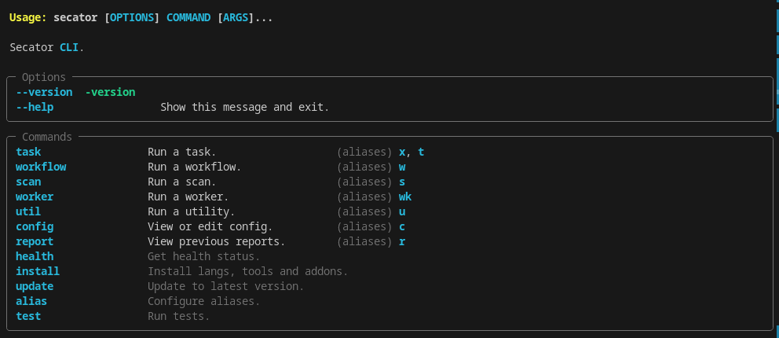

<h1 align="center">
	
</h1>

<h4 align="center">The pentester's swiss knife.</h4>

<p align="center">
<!-- <a href="https://goreportcard.com/report/github.com/freelabz/secator"></a> -->

<a href="https://github.com/freelabz/secator/releases"></a>
<a href="https://github.com/freelabz/secator/blob/main/LICENSE"></a>
<a href="https://pypi.org/project/secator/"></a>
<a href="https://twitter.com/freelabz"></a>
<a href="https://youtube.com/@FreeLabz"></a>
<!-- <a href="https://discord.gg/freelabz"></a> -->
</p>


<p align="center">
  <a href="#features">Features</a> •
  <a href="#supported-commands">Supported commands</a> •
  <a href="#install-secator">Installation</a> •
  <a href="#usage">Usage</a> •
  <a href="https://docs.freelabz.com">Documentation</a>
</p>

`secator` is a task and workflow runner used for security assessments. It supports dozens of well-known security tools
and it is designed to improve productivity for pentesters and security researchers.

# Features


* **Curated list of commands**

* **Unified input options**

* **Unified output schema**

* **CLI and library usage**

* **Distributed options with Celery**

* **Complexity from simple tasks to complex workflows**

* **Customizable**


## Supported tools

`secator` integrates the following tools:

| Name                                                          | Description                                                                    | Category       |
|---------------------------------------------------------------|--------------------------------------------------------------------------------|----------------|
| [httpx](https://github.com/projectdiscovery/httpx)            | Fast HTTP prober.                                                              | `http`         |
| [cariddi](https://github.com/edoardottt/cariddi)              | Fast crawler and endpoint secrets / api keys / tokens matcher.                 | `http/crawler` |
| [gau](https://github.com/lc/gau)                              | Offline URL crawler (Alien Vault, The Wayback Machine, Common Crawl, URLScan). | `http/crawler` |
| [gospider](https://github.com/jaeles-project/gospider)        | Fast web spider written in Go.                                                 | `http/crawler` |
| [katana](https://github.com/projectdiscovery/katana)          | Next-generation crawling and spidering framework.                              | `http/crawler` |
| [dirsearch](https://github.com/maurosoria/dirsearch)          | Web path discovery.                                                            | `http/fuzzer`  |
| [feroxbuster](https://github.com/epi052/feroxbuster)          | Simple, fast, recursive content discovery tool written in Rust.                | `http/fuzzer`  |
| [ffuf](https://github.com/ffuf/ffuf)                          | Fast web fuzzer written in Go.                                                 | `http/fuzzer`  |
| [h8mail](https://github.com/khast3x/h8mail)                   | Email OSINT and breach hunting tool.                                           | `osint`        |
| [dnsx](https://github.com/projectdiscovery/dnsx)              | Fast and multi-purpose DNS toolkit designed for running DNS queries.           | `recon/dns`    |
| [dnsxbrute](https://github.com/projectdiscovery/dnsx)              | Fast and multi-purpose DNS toolkit designed for running DNS queries (bruteforce mode).           | `recon/dns`    |
| [subfinder](https://github.com/projectdiscovery/subfinder)    | Fast subdomain finder.                                                         | `recon/dns`    |
| [fping](https://fping.org/)                                   | Find alive hosts on local networks.                                            | `recon/ip`     |
| [mapcidr](https://github.com/projectdiscovery/mapcidr)        | Expand CIDR ranges into IPs.                                                   | `recon/ip`     |
| [naabu](https://github.com/projectdiscovery/naabu)            | Fast port discovery tool.                                                      | `recon/port`   |
| [maigret](https://github.com/soxoj/maigret)                   | Hunt for user accounts across many websites.                                   | `recon/user`   |
| [gf](https://github.com/tomnomnom/gf)                         | A wrapper around grep to avoid typing common patterns.                         | `tagger`       |
| [grype](https://github.com/anchore/grype)                     | A vulnerability scanner for container images and filesystems.                  | `vuln/code`    |
| [dalfox](https://github.com/hahwul/dalfox)                    | Powerful XSS scanning tool and parameter analyzer.                             | `vuln/http`    |
| [msfconsole](https://docs.rapid7.com/metasploit/msf-overview) | CLI to access and work with the Metasploit Framework.                          | `vuln/http`    |
| [wpscan](https://github.com/wpscanteam/wpscan)                | WordPress Security Scanner                                                     | `vuln/multi`   |
| [nmap](https://github.com/nmap/nmap)                          | Vulnerability scanner using NSE scripts.                                       | `vuln/multi`   |
| [nuclei](https://github.com/projectdiscovery/nuclei)          | Fast and customisable vulnerability scanner based on simple YAML based DSL.    | `vuln/multi`   |
| [searchsploit](https://gitlab.com/exploit-database/exploitdb) | Exploit searcher. | `exploit/search`    |

Feel free to request new tools to be added by opening an issue, but please 
check that the tool complies with our selection criterias before doing so. If it doesn't but you still want to integrate it into `secator`, you can plug it in (see the [dev guide](https://docs.freelabz.com/for-developers/writing-custom-tasks)).


## Installation

`secator` requires **python >= 3.8**.

<details>
  <summary>Bash</summary>

    wget -O - https://raw.githubusercontent.com/freelabz/secator/main/scripts/install.sh | sh

This script installs the latest Go and Ruby versions, all the tools supported by `secator`, as well as `secator` itself.
</details>

<details>
	<summary>PyPI</summary>

	pipx install secator

  You can also use `pip install secator` but make sure you are in a virtual environment !

  Then you can run:

	secator install go    # latest version of Go
	secator install ruby  # latest version of Ruby
	secator install tools # supported tools

  Note: you can skip these steps if you are managing tools externally, or don't want to install everything.

</details>

<details>
	<summary>Docker</summary>

	docker run freelabz/secator

The Docker image is quite big, because it contains all the tools supported by `secator`.
</details>

<details>
	<summary>Development build</summary>

  ```
git clone https://github.com/freelabz/secator
cd secator
pipx install -e .[dev]
  ```

</details>


## Usage
```sh
secator --help
```



### Usage examples

Run a fuzzing task (`ffuf`):

```sh
secator x ffuf http://testphp.vulnweb.com/FUZZ
```

Run a url crawl workflow:

```sh
secator w url_crawl http://testphp.vulnweb.com
```

Run a host scan:

```sh
secator s host mydomain.com
```

and more... to list all tasks / workflows / scans that you can use:
```sh
secator x --help
secator w --help
secator s --help
```

## Learn more

To go deeper with `secator`, check out:
* Our complete [documentation](https://docs.freelabz.com)
* Our getting started [tutorial video](https://youtu.be/-JmUTNWQDTQ?si=qpAClDWMXo2zwUK7)
* Our [Medium post](https://medium.com/p/09333f3d3682)
* Follow us on social media: [@freelabz](https://twitter.com/freelabz) on Twitter and [@FreeLabz](https://youtube.com/@FreeLabz) on YouTube

## Stats

<a href="https://star-history.com/#freelabz/secator&Date">
  <picture>
    <source media="(prefers-color-scheme: dark)" srcset="https://api.star-history.com/svg?repos=freelabz/secator&type=Date&theme=dark" />
    <source media="(prefers-color-scheme: light)" srcset="https://api.star-history.com/svg?repos=freelabz/secator&type=Date" />
    
  </picture>
</a>
